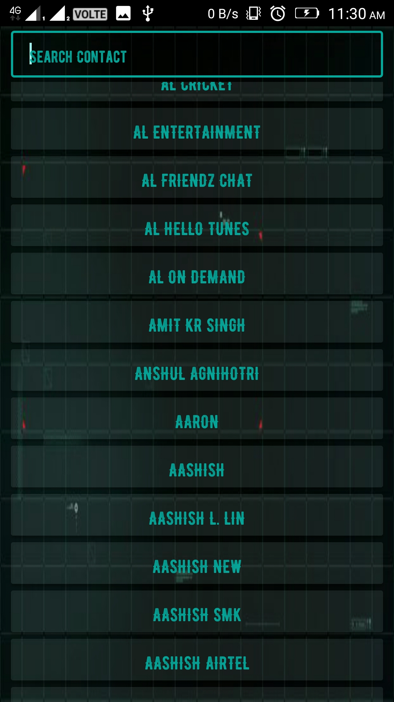

<h2 align="center"><b>SyFy Android Contacts</b></h2>
<h4 align="center">Contacts manager app, with a Scifi UI</h4>
<h5 align="center">The contact manager app provides some cool audio on clicks and gives direct option to call, sms, whatsapp to your contacts</h5>
<h2 align="center">
ScreenShots</h2>

 <h4 align="center">

</h4>

## Features

* List of all the contacts
* Detail view of contact
* Cool audio on clicks
* Direct call, sms & whatsapp options from detail view

## Getting Started

_Follow these instructions to build and run the project.._

1. Clone this repository.
3. [Install Android Studio](https://developer.android.com/sdk/index.html).
5. Import the project. Open Android Studio, click `Open an existing Android
   Studio project` and select the project. Gradle will build the project.
6. Run the app. Click `Run > Run 'app'`. After the project builds you'll be
   prompted to build or launch an emulator.

### Build with gradle

If you donot have Android Studio, you can build your app with gradle

OS X & Linux:

`./gradlew assembleRelease`

Windows:

`gradlew.bat assembleRelease`

The output apk will be in `/app/build/outputs/apk/release`.
Transfer the apk to your device and install it to use the application.

## Note
* Permissions are requested at the initial splash screen. Do not deny the permission after, as it will cause the app to not function correctly.

## Contributors

