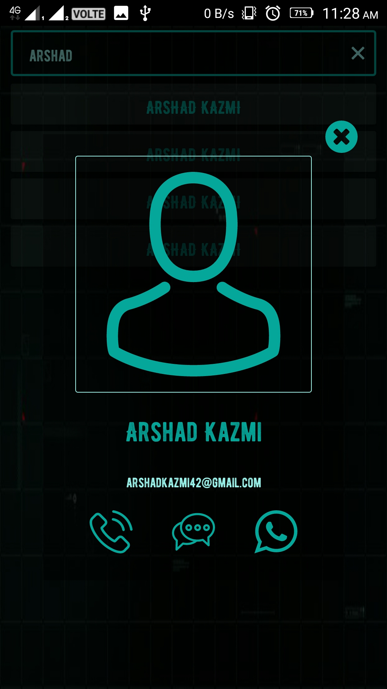

# android-contacts-scifiui
<b>Android Contacts App</b>  
<b>Android Features Used</b> 
1. Async Task (For fetching contacts using ContentProviders) 
2. Custom click sounds 
3. Custom Popups 
4. RecyclerView 

Note: Marshmallow runtime permissions support not added. You need to enable permission manually in app settings for this app to work

## ScreenShots

